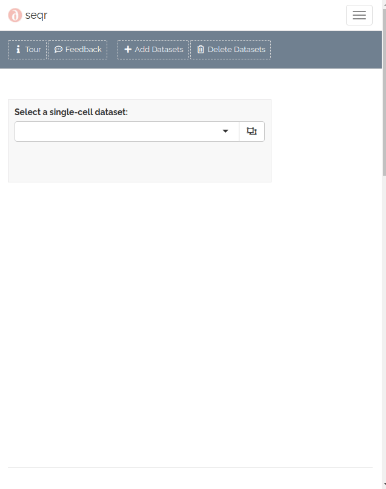

<!--  -->

<!-- 
GIFs look best at full width (637px)
height can vary as desired
 -->

  

### Add datasets

To add single-cell datasets:
-  click Dataset Management > Import
-  drag and drop files to upload
-  provide a sample name for associated files
-  when done, click **Import Datasets**

<!--  -->

<!--  -->


<!--  -->




<!--  - Only human fastq.gz files are currently supported.   <a href='mailto:alexvpickering@gmail.com'>submit a request →</a>" >}} -->
