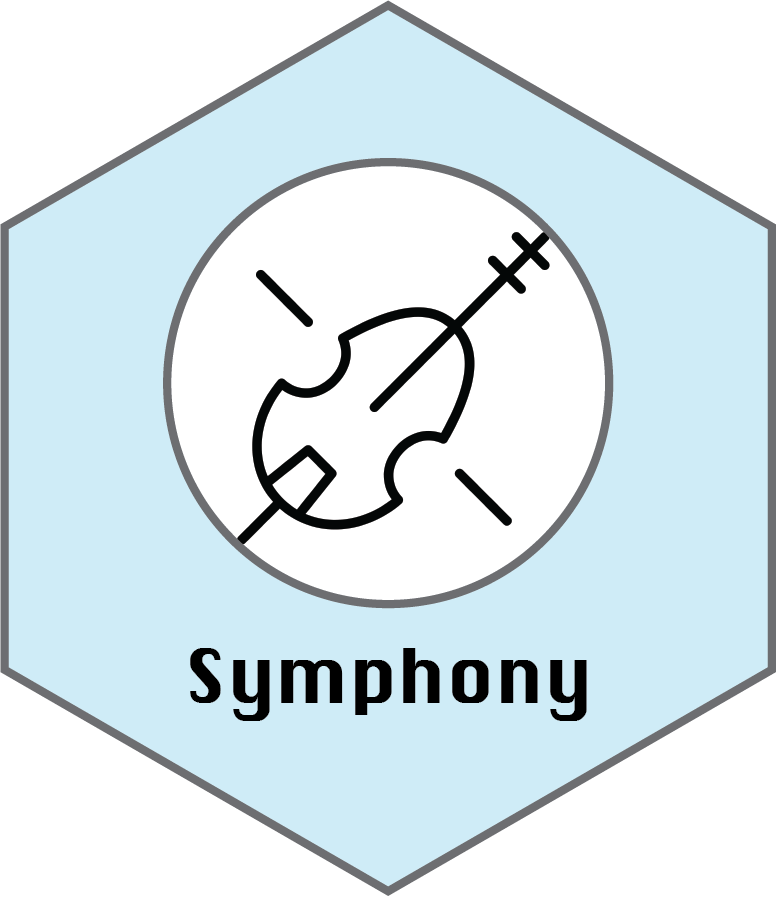

### Reference Mapping

Reference mapping uses a previously processed and annotated dataset as a reference. Your data is projected into the UMAP coordinates of the reference and the predicted clusters and associated labels are also derived from the reference. 

You can select a reference any time that you generate a new dataset:

- Dataset Import
- Dataset Subset
- Dataset Integration



### Available References

| 
Reference
  | Species | Demo   |  Source Link  |
|-------------------------------------------|:-------:|:------:|:-------------:|
| PBMC                                      | 🧑      |        |  |
| Lung                                      | 🧑      |        |  |
| Bone Marrow                               | 🧑      |        |  |
| Motor Cortex                              | 🧑      |        |  |
| Motor Cortex                              | 🐭      |        |  |
| Differentiated CD4 T-cells                | 🧑      | ✅     | <a href="https://www.nature.com/articles/s41467-020-15543-y" target="_blank">📜</a> |
| Tumor-Infiltrating T-cells                | 🐭      | 🔜     |  |
| Virus-Specific CD8 T-cells                | 🐭      | 🔜     |  |
| Virus-Specific CD4 T-cells                | 🐭      | 🔜     |  |
| 10x PBMCs Atlas                           | 🧑      |        |  |
| Cornell scMuscle                          | 🐭      | ✅     | <a href="https://datadryad.org/stash/dataset/doi:10.5061%2Fdryad.t4b8gtj34" target="_blank">💪</a> |


